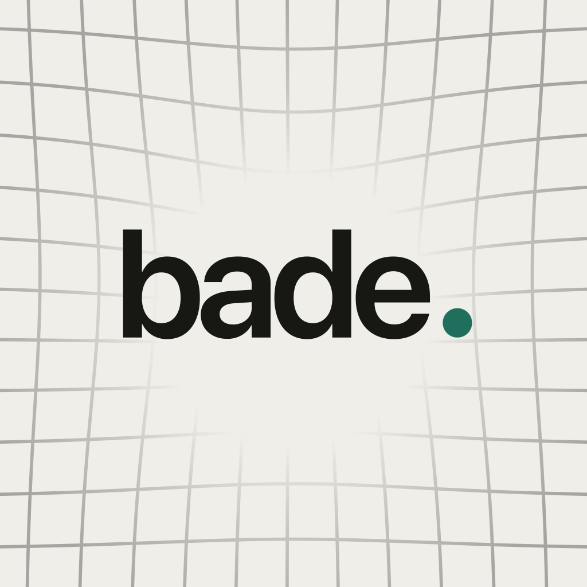

<div align="center">



# Bade

**How much are you paying a month?**

Bade finds every recurring charge in your bank statement — without ever asking for your bank password, and without sending anything anywhere.

</div>

---

## The problem

You know about Netflix and Spotify. You don't know about the €4.99 thing you signed up for in March, the trial that quietly became a subscription, or the fact that your bank's exchange rate is costing you real money every time a dollar subscription renews.

Your bank statement already has all of it. It's just unreadable.

## What Bade does

Export a PDF statement from your banking app, share it into Bade, and it reads every transaction on your phone — then shows you what actually repeats.

- **Finds what repeats.** Weekly, monthly, quarterly, semiannual, annual. Bade groups charges by merchant, works out the rhythm, and only calls something a subscription when the dates agree.
- **Tells you how sure it is.** Three charges on a rhythm is *Confident*. Two is *Probably*. Anything weaker is flagged rather than assumed. You confirm what's real before it's saved.
- **Catches price changes.** When a subscription quietly goes from 11.99 to 13.99, that shows up in its history with the old price and the new one.
- **Shows what the conversion cost.** For anything charged in a foreign currency, Bade puts the rate your bank actually used next to the reference rate — and what the gap costs you over a year.
- **Knows what's coming.** A calendar of upcoming charges, and a reminder before one lands.
- **Puts it on your home screen.** A widget with your monthly total and what's next.
- **Handles the messy parts.** Re-import the same statement and nothing duplicates. A subscription that stopped charging months ago stops being counted. Merchants that rename themselves stay one subscription.

Nothing repeating in the statement? Bade says so plainly and suggests a longer export, rather than inventing something.

## Privacy

This is the part that isn't a feature — it's the design.

- **Statement files are never written to disk.** Bade parses them in memory and discards them immediately. Nothing is cached, nothing is recoverable.
- **No accounts, no backend, no analytics, no crash reporting.** There is no server to send anything to.
- **No bank credentials, ever.** Bade reads a file you already exported. It never touches your bank.
- **One optional network call.** If a statement doesn't print an exchange rate to compare against, Bade can ask the National Bank for that day's published rates — a date in, rates out. No account data, no merchant names, no identifiers. It's a toggle in Settings, and the app works fully with it off.
- **Works with Apple Intelligence unavailable.** Merchant cleanup is deterministic. Nothing about the app depends on a model being present.

## Bade Pro

An app that charges a subscription to track subscriptions is a punchline. Bade Pro is **one payment, no subscription, ever** — bought once and tied to your Apple Account.

Pro covers the FX markup breakdown, upcoming charges, renewal reminders, and widgets.

## Language & accessibility

English and Georgian throughout — 210 strings, no hardcoded text anywhere in a view. Every screen supports Dynamic Type up to the largest sizes, light and dark appearance, and Reduce Motion. Money always renders with its own symbol (₾, ₺, ֏), placed where the reader's locale expects it.

---

## Status

In development, pre-release. The import pipeline, detection engine, subscription management, exchange-rate engine, widget, reminders, and purchase flow are built and tested. Statement parsers currently cover two Georgian banks' PDF exports; more formats are the obvious next thing.

Some items on the Pro page — category analytics, spending trends, themes and custom icons, price-increase alerts — are planned rather than shipped.

## Building

Requires Xcode 26 and iOS 26. Open `Bade.xcodeproj` and run.

All real code lives in `BadeKit`, a Swift package. The full test suite runs on the host in about two seconds:

```sh
cd BadeKit && swift test
```

484 tests across 63 suites. The package declares macOS purely so `swift test` runs without a simulator; Bade ships iOS-only.

## How it's built

Swift 6 with strict concurrency, SwiftUI, SwiftData, Swift Testing. Fifteen modules with enforced boundaries — `Core` depends on nothing, feature modules never import each other, and only the composition root knows about all of them.

```
Core           entities and protocols — Foundation only
Ingestion      PDF/text → transactions. One parser per statement format.
Normalization  raw descriptor → merchant name
Catalog        439 bundled services, 141 with published price points
Detection      the recurrence engine. Pure, no I/O.
FX             exchange rates and markup
Pipeline       composes ingestion → normalization → detection
Persistence    SwiftData. Sealed — nothing else imports it.
Purchases      the one StoreKit import
Notifications  reminder planning (pure) + the one UserNotifications import
Widgets        home screen snapshot and timeline
DesignSystem   theme, type, spacing, motion, haptics, components
Localization   the one string catalog, typed keys, money formatting
Features       Welcome, Import, Subscriptions, Upcoming, Settings
App            composition root
```

Two rules shape most of the code:

**Money is always `Decimal`.** Never a floating-point type, with no exceptions anywhere in the codebase.

**Arithmetic is always deterministic Swift.** Where a language model is involved at all, it normalises merchant strings and nothing else. Cadence, totals, FX, and detection are code you can read and test.

Testing is golden-file first: a real anonymised statement in, an exact expected subscription set out. Every bug that made it out of a real statement becomes a permanent fixture. Real statements never enter the repository — committed fixtures are scrubbed derivatives.

---

## License

Source-available. Copyright © 2026 Daviti Khvedelidze. All rights reserved.

You're welcome to read this code, learn from it, and reference it. It is **not** licensed for reuse, redistribution, or derivative works. Bade is a commercial product.

Bade is an independent app and is not affiliated with, endorsed by, or sponsored by any bank or financial institution.
